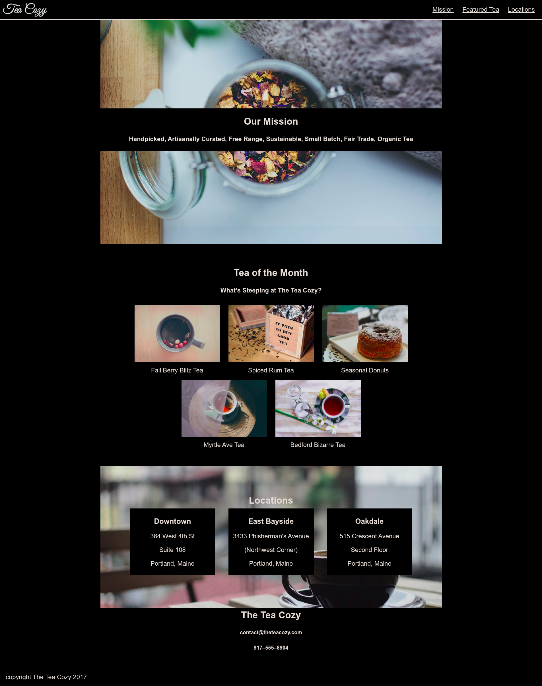
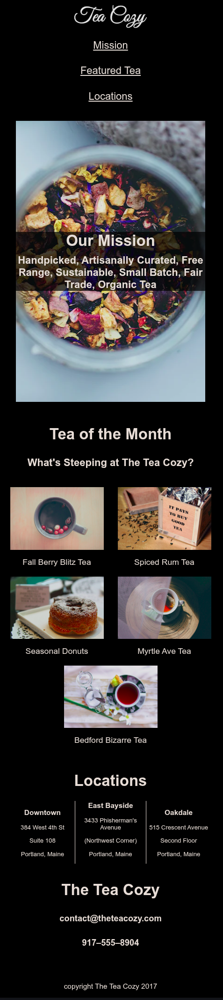

# 🍵 The Tea Cozy


[](https://github.com/ArekKrak/tea-cozy)

A responsive fictional tea shop homepage built with **HTML5** and **CSS3 (Flexbox)** as part of Codecademy’s *Off-Platform Project: Tea Cozy*.  

The site demonstrates how to take a **design spec** and implement it into working code, focusing on layout accuracy, responsive design, and clean structure.

---

## Project Overview

**Context:**  
This project replicates a tea shop’s homepage based on Codecademy’s design spec. It includes a fixed header, featured products, mission section, and locations.

**Your role:**  
Translate the provided design spec into functional **HTML/CSS code**, using Flexbox and media queries for responsiveness.

**Main Features Implemented:**
- A fixed **header** with logo and navigation bar.  
- A **mission section** with background image and text overlay.  
- A **featured products (Tea of the Month)** section with images and captions.  
- A **locations section** with addresses in styled boxes.  
- A **footer** with contact details and copyright info.  
- Responsive layout across desktop, tablet, and mobile devices.

---

## Tech Stack

- **HTML5** (semantic structure)
- **CSS3** (Flexbox, media queries)
- **Tools**: Visual Studio Code, Git, GitHub

---

## Project Structure

```
tea-cozy/
├── index.html  # Main HTML file
├── styles.css  # CSS stylesheet
├── img/        # Provided images (logo, background, teas, locations)
└── README.md   # Project documentation
```

---

## How It Works


1. **Header & Navigation**  
    - Fixed header with Tea Cozy logo and navigation links.  
    - Stays visible at the top of the page when scrolling.  

2. **Mission Section**  
    - Full-width background image with overlay text (“Our Mission”).  

3. **Tea of the Month**  
    - Grid of featured teas and seasonal items with captions.  

4. **Locations**  
    - Background image with flexbox-based address cards.  
    - Three shop locations styled as columns (Downtown, East Bayside, Oakdale).  

5. **Footer**  
    - Contact information and copyright notice. 

---

## How to Run

1. Clone the repository:
```
  git clone https://github.com/ArekKrak/tea-cozy.git
  cd tea-cozy
```
2. Open the project

    - Simply open ```index.html``` in your web browser.

    - Or use a live server (e.g., VS Code Live Server extension) for best results.

## Example Screenshots




---

## Key Concepts Demonstrated

- Converting a **design spec** into working HTML/CSS  
- Fixed positioning for navigation  
- Flexbox for responsive image grids and layouts  
- Background images with text overlays  
- Responsive design with **media queries**  
- Clean project structure and file organization

---

## Future Improvements

- Add a responsive hamburger menu for navigation on mobile.  
- Improve accessibility (alt text, ARIA labels, semantic tags).  
- Add hover effects for teas and location cards.  
- Optimize images for faster performance.  
- Extend into a multi-page website (shop, about, contact). 

---

## Acknowledgements

- Project brief provided by Codecademy.
- Images from Codecademy project files. 
- Built purely for learning purposes. 

---

## Contact
If you're a recruiter, mentor, or fellow developer interested in collaboration or feedback:

**Arek Krakowiak**  
[369arek12@protonmail.com](mailto:369arek12@protonmail.com)

---

🍵 Thank you for viewing this project!